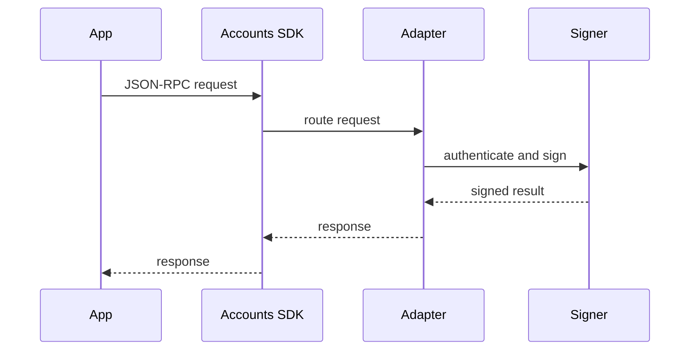

# Adapters

Adapters decide where keys live, who runs authentication, and how account requests are approved. Your app talks to the Accounts SDK through one provider surface while the adapter handles signing.

| Adapter | Who owns auth | Best for |
| --- | --- | --- |
| [Tempo Wallet](/docs/adapters/tempo-wallet) | Tempo Wallet | Apps that want a universal wallet without owning signing infrastructure. |
| [WebAuthn](/docs/adapters/webauthn) | Your app origin | Teams that want domain-bound passkeys and Tempo account features. |
| [Custom](/docs/adapters/custom) | Your infrastructure | Privy, AWS KMS, Turnkey, internal signers, and hosted wallet products. |

## Next Steps

- [Tempo Wallet](/docs/adapters/tempo-wallet)
- [WebAuthn](/docs/adapters/webauthn)
- [Custom adapter](/docs/adapters/custom)
- [Adapter API reference](/docs/api/adapters)
