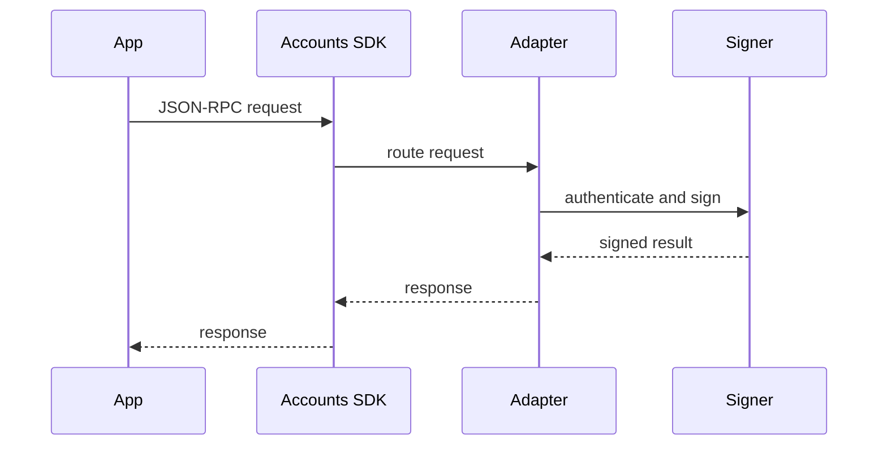

import { Cards, Card } from 'vocs'

# Adapters

## Overview

Adapters decide where keys live, who runs authentication, and how account requests are approved. Your app talks to the Accounts SDK through one provider surface while the adapter handles signing.

| Adapter                                     | Who owns auth       | Best for                                                                            |
| ------------------------------------------- | ------------------- | ----------------------------------------------------------------------------------- |
| [Tempo Wallet](/docs/adapters/tempo-wallet) | Tempo Wallet        | Apps that want a universal wallet without owning signing infrastructure.            |
| [WebAuthn (Passkeys)](/docs/adapters/webauthn) | Your app origin  | Teams that want domain-bound passkeys and Tempo account features.                   |
| [Turnkey](/docs/adapters/turnkey)           | Turnkey             | Apps that want Turnkey to own key custody and authentication.                       |
| [Privy](/docs/adapters/privy)               | Privy               | Apps that want Privy auth and embedded wallets with Tempo account features.         |
| [Private Key](/docs/adapters/private-key)   | Your environment    | Server-side signers with a pinned key, or development with a random in-storage key. |
| [Custom](/docs/adapters/custom)             | Your infrastructure | AWS KMS, internal signers, and other hosted wallet products.                        |

## Next Steps

<Cards>
  <Card
    description="Universal account hosted on Tempo"
    icon="lucide:wallet"
    to="/docs/adapters/tempo-wallet"
    title="Tempo Wallet"
  />
  <Card
    description="Passkey accounts bound to your own origin"
    icon="lucide:fingerprint"
    to="/docs/adapters/webauthn"
    title="WebAuthn (Passkeys)"
  />
  <Card
    description="Accounts custodied by Turnkey infrastructure"
    icon='<svg viewBox="-18 -12 50 50" fill="none" xmlns="http://www.w3.org/2000/svg"><path d="m8.023 11.354 6.518 14.253H0l6.518-14.253a.828.828 0 0 1 1.505 0ZM7.27 9.145a4.576 4.576 0 0 0 4.579-4.572A4.576 4.576 0 0 0 7.269 0a4.576 4.576 0 0 0-4.578 4.573A4.576 4.576 0 0 0 7.27 9.145Z" fill="currentColor"/></svg>'
    to="/docs/adapters/turnkey"
    title="Turnkey"
  />
  <Card
    description="Accounts backed by Privy auth and embedded wallets"
    icon="lucide:shield"
    to="/docs/adapters/privy"
    title="Privy"
  />
  <Card
    description="Direct private key accounts"
    icon="lucide:key-round"
    to="/docs/adapters/private-key"
    title="Private Key"
  />
  <Card
    description="Bring your own auth infrastructure"
    icon="lucide:plug"
    to="/docs/adapters/custom"
    title="Custom"
  />
</Cards>
