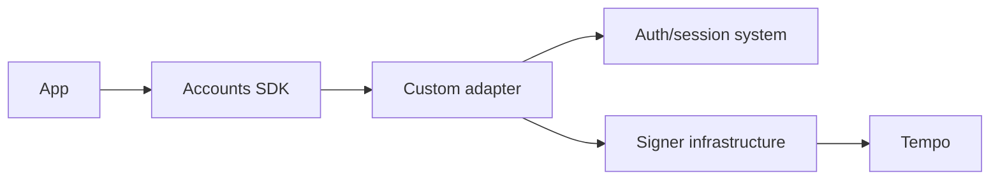

# Bring Your Auth

Bring your own authentication and signing infrastructure, then expose it to app code through an Accounts SDK adapter.

This path is for teams that already have user identity, compliance, custody, or signing requirements that should remain outside Tempo Wallet.

## Common patterns

| Pattern | Use it when |
| --- | --- |
| [Privy](/docs/enterprise/bring-your-auth/privy) | Privy owns app auth and wallet state. |
| [AWS KMS](/docs/enterprise/bring-your-auth/aws-kms) | Keys live in AWS-controlled infrastructure. |
| [Turnkey](/docs/enterprise/bring-your-auth/turnkey) | Turnkey owns signer infrastructure. |
| [Custom](/docs/enterprise/bring-your-auth/custom) | Your own service owns auth, signing, or wallet hosting. |

## Integration shape

## Human Pass Needed

This section needs enterprise positioning and security review before publishing as final guidance.

## Next Steps

- [Custom adapter](/docs/adapters/custom)
- [Hosted Universal Wallets](/docs/enterprise/hosted-universal-wallets)
- [Spend Permissions](/docs/guides/spend-permissions)
