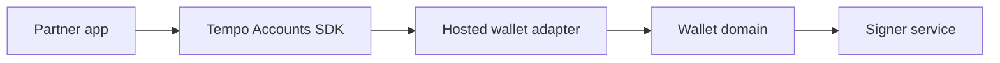

# Hosted Universal Wallets

Host a universal wallet on your own domain, then expose it to apps through a custom adapter.

Use this path when you want the portability of a wallet surface but need to own the domain, brand, auth, or signer infrastructure.

## Architecture

## Human Pass Needed

This page needs product and security input before implementation. The final version should define domain trust, iframe or popup behavior, account portability, and operational responsibilities.

## Next Steps

- [Custom adapter](/docs/adapters/custom)
- [Bring Your Auth](/docs/enterprise/bring-your-auth)
- [Deploying to Production](/docs/production)
